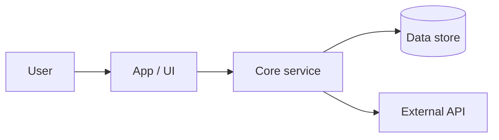

# Component Diagram

Last updated: <yyyy-mm-dd>

```mermaid
flowchart LR
    U[User] --> A[App / UI]
    A --> B[Core service]
    B --> C[(Data store)]
    B --> D[External API]
```

## Notes
- Anything surprising about a connection — auth, rate limits, why it's shaped
  this way.
