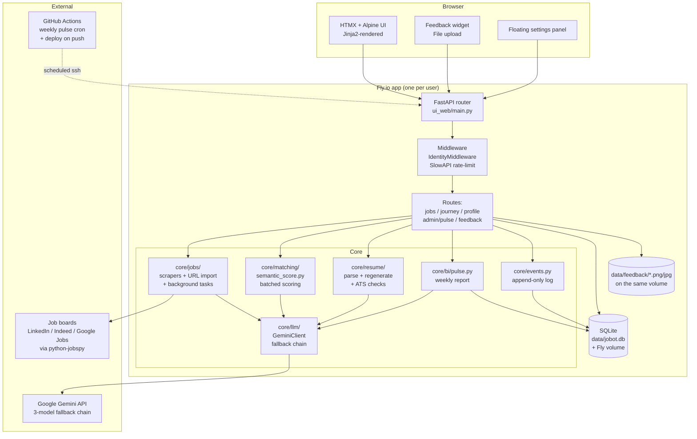
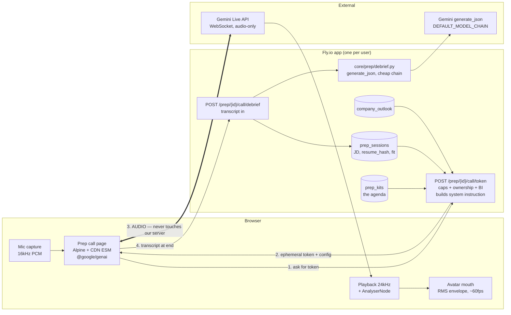

# Component Diagram

Last updated: 2026-08-21

## Notes

- **One instance of the whole diagram per user** during POC — the
  outer `Fly.io app` box is replicated across 3 apps today
  (`jobbotv2`, `jobbotv2-hermana`, `jobbotv2-melissa`). See ADR-001.
- **Middleware order matters.** IdentityMiddleware runs FIRST so
  downstream Gemini calls see the right identity for per-day cap
  accounting. SlowAPI's SQLite-backed store persists rate-limit
  counters across Fly's `auto_stop_machines` cycling.
- **Gemini boundary is provider-agnostic by design.** `GeminiClient`
  exposes `generate_json(prompt) -> dict`. The multi-provider
  migration (ADR-004 consequence) will swap the client, not the
  callers.
- **Job scraping is synchronous during a search request** but
  batched inside `core/matching/semantic_score.py` (6 jobs per
  Gemini call, sequential — chosen deliberately to avoid rate
  limits + "lost in the middle" degradation).
- **Feedback screenshots** are written to `data/feedback/` on the
  Fly volume alongside `jobot.db`. File extension follows the
  uploaded mime (png / jpg / webp / gif); the DB stores only the
  path.
- **The pulse cron runs from GH Actions**, not an in-app scheduler.
  Wakes the (auto-stopped) Fly machine via `/healthz` first, then
  runs `python -m core.bi.pulse` over SSH.
- **No third-party analytics or telemetry.** Only the signal tables
  in the local SQLite feed the pulse report.

---

## The live prep call (REQ-041 / ADR-047) — planned, flag-gated

> Added 2026-09-16. The main diagram above predates Prep entirely and is
> **stale** (no `core/prep/`, no Tavily hop) — backfilling it is its own pass.
> This sub-diagram is drawn separately because the live call introduces the one
> genuinely new *shape* in jobot's architecture: **an edge from the browser
> straight to an external provider, bypassing our server.**

Read the thick edge (3) as the whole point: our machine mints a short-lived
token and steps out of the media path. It is sized for HTML fragments, not for
carrying five minutes of PCM.

Three properties fall out of that shape:

- **The token endpoint is the only enforcement point that exists.** Caps,
  ownership and BI logging live there, because nothing after it is ours to
  police (ADR-051).
- **Grounding is front-loaded, not supervised.** The agenda goes into the system
  instruction before the socket opens (ADR-048); we cannot inspect turns.
- **The avatar is a local rendering of audio already in the browser's graph** —
  zero tokens, zero server CPU, and the reason we stay in the 15-minute
  audio-only lane instead of the 2-minute video one (ADR-050).
