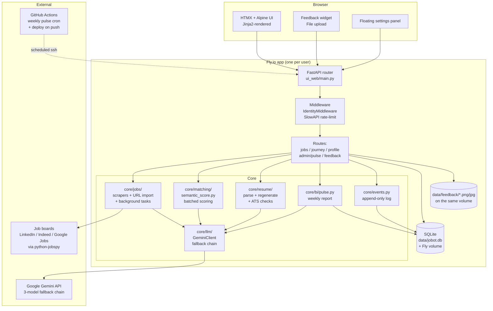

# Component Diagram

Last updated: 2026-08-21

## Notes

- **One instance of the whole diagram per user** during POC — the
  outer `Fly.io app` box is replicated across 3 apps today
  (`jobbotv2`, `jobbotv2-hermana`, `jobbotv2-melissa`). See ADR-001.
- **Middleware order matters.** IdentityMiddleware runs FIRST so
  downstream Gemini calls see the right identity for per-day cap
  accounting. SlowAPI's SQLite-backed store persists rate-limit
  counters across Fly's `auto_stop_machines` cycling.
- **Gemini boundary is provider-agnostic by design.** `GeminiClient`
  exposes `generate_json(prompt) -> dict`. The multi-provider
  migration (ADR-004 consequence) will swap the client, not the
  callers.
- **Job scraping is synchronous during a search request** but
  batched inside `core/matching/semantic_score.py` (6 jobs per
  Gemini call, sequential — chosen deliberately to avoid rate
  limits + "lost in the middle" degradation).
- **Feedback screenshots** are written to `data/feedback/` on the
  Fly volume alongside `jobot.db`. File extension follows the
  uploaded mime (png / jpg / webp / gif); the DB stores only the
  path.
- **The pulse cron runs from GH Actions**, not an in-app scheduler.
  Wakes the (auto-stopped) Fly machine via `/healthz` first, then
  runs `python -m core.bi.pulse` over SSH.
- **No third-party analytics or telemetry.** Only the signal tables
  in the local SQLite feed the pulse report.
