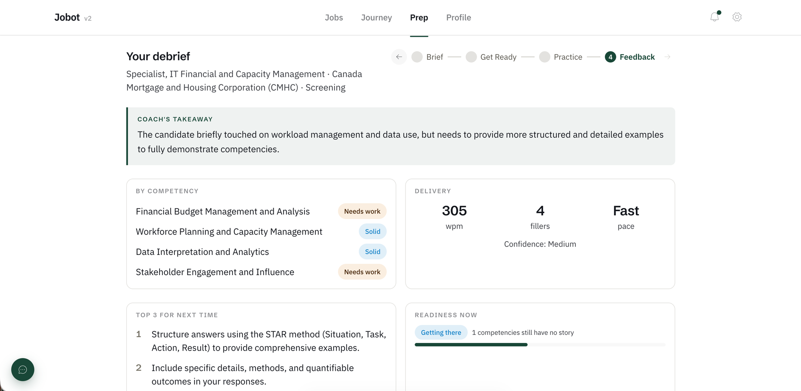
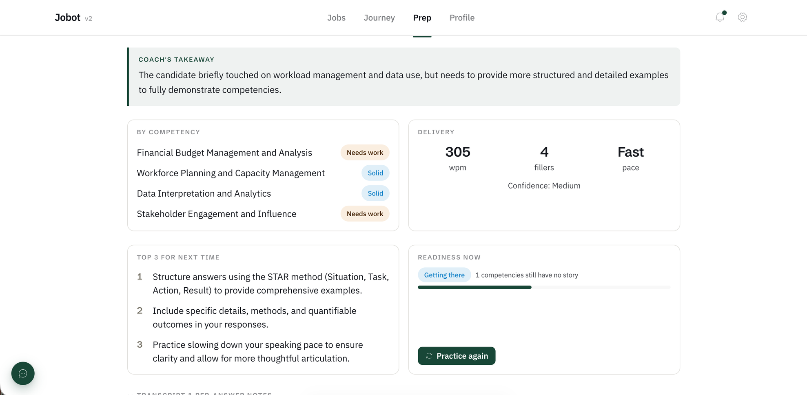

# Honest feedback — "Solid" for junk answers → a 0–100 you can audit

2026-10-01 · **Before / after · problem cracked** · [ADR-059](../decisions/ADR-059-practice-session-score.md) · [REQ-042](../requirements/REQ-042-scoring-inventory-and-principles.md) · [REQ-043](../requirements/REQ-043-delivery-gauges-and-baselines.md) · commits `fd08658`, `621a77f`

## The moment
After a deliberately bad mock interview (off-topic, "I don't care about the
position"), Jobot's feedback rated two competencies **"Solid"** and reported
**305 words per minute**. Normal speech is about 150. The AI was grading on
vibes and guessing numbers.

We rebuilt it:
- The AI now only answers five yes/no checks per competency, and it has to
  quote your exact words. Code verifies the quote and does the maths.
- Speaking pace and filler words are measured, then shown on gauges against
  research baselines (about 150 wpm; about 2.6 "uh/um" per 100 words, Bortfeld
  et al. 2001).

The same bad session now scores **30 / 100, "Not interview-ready yet"**.

## Why it matters
A practice tool that flatters you is worse than none: you walk into the real
interview overconfident. The principle we wrote down: **the AI gives evidence,
code does the maths, and no credit without proof.**

## Visuals

*Before: two "Solid" grades for answers that weren't answers; 305 wpm guessed by the model.*

*Before: "Readiness now" used a full card for one pill and one line.*

📸 **After: to capture.** The same session 39 now shows the score ring at 30, per-competency ✓/✗ checks with your quoted words, and the pace and filler gauges.
→ https://jobbotv2-edu.fly.dev/interviews/3/practice/39/feedback

## Post draft
**EN** — Our AI interview coach gave "Solid" to answers like "honestly, I don't
care about the position" and said I spoke 305 words a minute. So we changed the
rule: the AI must quote your exact words for every point, code does the math,
and speaking pace is measured against research (about 150 wpm normal). Same
session now: 30/100. Honest beats flattering. #buildinpublic #AI

**ES** — Nuestro coach de entrevistas con IA calificaba "Sólido" respuestas
como "la verdad, no me importa el puesto" y decía que hablé a 305 palabras por
minuto. Cambiamos la regla: la IA debe citar tus palabras exactas para cada
punto, el código hace la cuenta, y el ritmo se mide contra la investigación
(~150 ppm). Misma sesión: 30/100. Mejor honesto que halagador.
