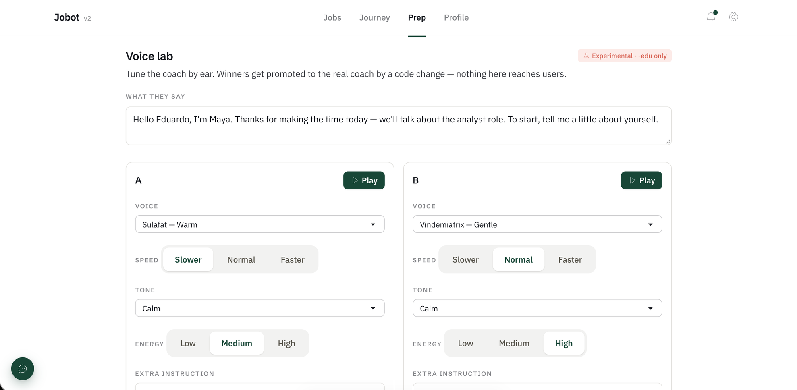

# The voice lab — tuning an AI interviewer by ear

2026-10-01 · **First · experiment** · [REQ-046](../requirements/REQ-046-voice-playground.md) · [ADR-068](../decisions/ADR-068-voice-lab-edu-only-live-override.md) · commit `9c58b0a`

## The moment
Jobot's mock interviewer talks out loud. Testers said all the voices sounded like
marketing: upbeat, high energy, salesy. That's the opposite of a calm recruiter
on a screening call. AI voice models have no "pitch" or "speed" dial, so we
built a lab. You pick any of 30 voices, set speed, tone and energy in plain
words, and hear two versions side by side. You vote blind, and the winner
becomes the coach.

## Why it matters
Practising with a hyped-up voice doesn't prepare you for a real HR call. It
raises your nerves instead of calming them. "Sounds right" is a judgement
only a human ear can make, so we turned it into a quick, logged experiment
instead of guessing.

The first measurement: the same greeting took **11.5 s** in "calm, slower" vs
**7.6 s** in "upbeat, faster". The knobs really change how the interviewer
comes across.

## Visuals

*A/B: Sulafat ("Warm") vs Vindemiatrix ("Gentle"), each with its own speed / tone / energy, reading the coach's real opening line.*

📸 Still to capture: the blind verdict + leaderboard after the first round of votes; a live session with the "Lab" chip.

## Post draft
**EN** — Our AI mock interviewer sounded like a sales pitch. Real HR screeners
are calm. AI voices have no pitch or speed dial, so we built a lab: 30 voices,
speed / tone / energy as plain-language instructions, blind A/B votes. Same
greeting: 11.5 s calm vs 7.6 s upbeat. The winner becomes Jobot's interviewer.
#buildinpublic #AI #jobsearch

**ES** — Nuestro entrevistador de IA sonaba a vendedor. Un reclutador real es
tranquilo. Las voces de IA no tienen perilla de tono ni velocidad, así que
armamos un laboratorio: 30 voces, velocidad / tono / energía como
instrucciones, votación A/B a ciegas. Mismo saludo: 11,5 s tranquilo vs 7,6 s
animado. La ganadora será la entrevistadora de Jobot.
