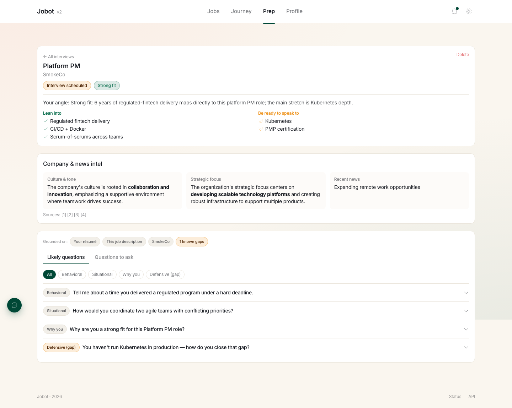
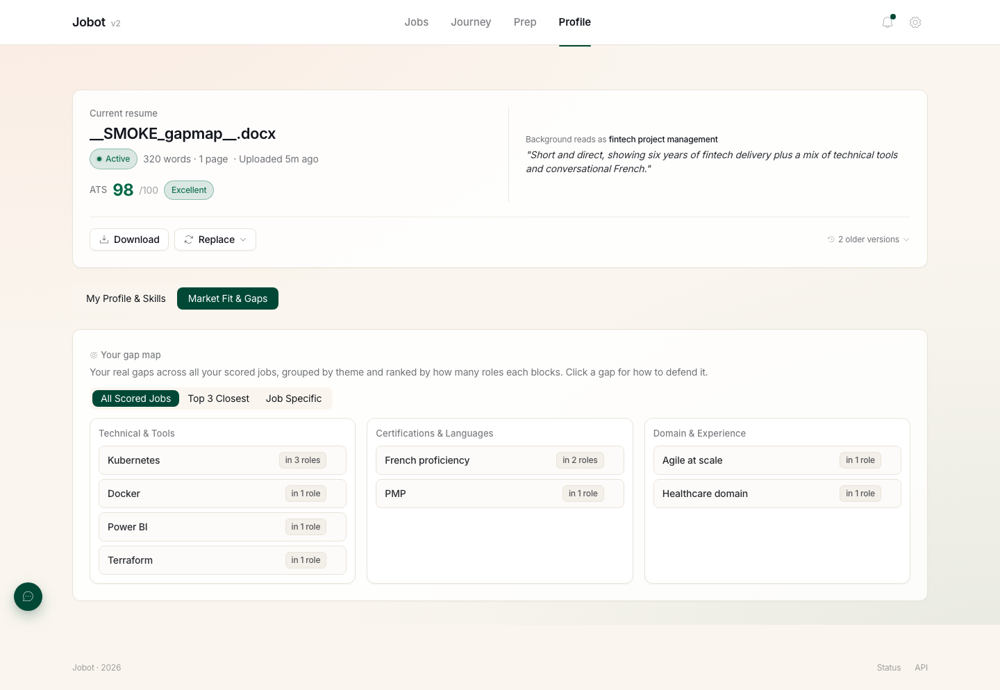
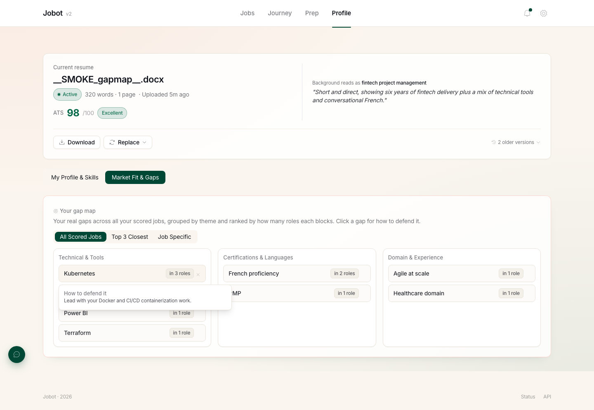

# Stranger one-pager — copy draft

Date: 2026-09-07
For: REQ-027 · Phase 0 stranger cohort
Voice: user = hero, jobot = guide (ADR-032). Web-first (ADR-033).
Register: LatAm Spanish primary (REQ-001), English parallel.

> Draft copy only — not final layout. Screenshots are REAL captures from
> jobbotv2-edu (verify-on-edu skill, 2026-09-07, 1440px desktop), using the
> anonymized Carlos Mendez / SmokeCo fixture — swap for a real, clean-branded
> case before publishing. StoryBrand SB7 spine noted per block.
> Assets live in `assets/stranger-page/`.

---

## 1 · Hero  (SB7: hero + problem + guide, above the fold)

**ES**
# La estrella eres tú.
### Nosotros somos tu equipo de soporte.
Buscar trabajo agota: postularte una y otra vez, empezar de cero cada vez, y
sentir que nadie ve todo lo que vales. No lo hacemos por ti — te quitamos peso de
encima para que muestres tu verdadero potencial.

**[ Probar con una vacante real → ]**

*Sin inventar nada. Sin adornos. Solo tú, mejor presentado.*

**EN**
# You're the star.
### We're your support team.
Job hunting drains you: applying over and over, starting from a blank page every
time, feeling like no one sees everything you're worth. We don't do it for you —
we lighten the load so you can show your real potential.

**[ Try it on a real job → ]**

*Nothing invented. No fluff. Just you, presented better.*

**Hero visual** — the honest fit read (top region of this capture: band +
your angle + what you lean into / what to speak to):

---

## 2 · The problem, named  (SB7: problem — external / internal)

**ES**
No es que no seas suficiente. Es que el sistema no te deja verte.
- Mandas decenas de postulaciones y no sabes por qué no te llaman.
- Un reclutador lee una lista rankeada por IA de arriba hacia abajo — y casi
  nunca llega hasta ti.
- Cada aplicación es otra página en blanco que te desgasta.

**EN**
It's not that you're not enough. It's that the system won't let you be seen.
- You send dozens of applications and never learn why no one calls back.
- A recruiter reads an AI-ranked list top-down — and rarely reaches you.
- Every application is another blank page wearing you down.

---

## 3 · The plan — 3 steps  (SB7: the plan, remove risk)

**ES**
### Cómo funciona
1. **Pega una vacante.** Te damos una lectura honesta de qué tan bien encajas —
   y qué te falta. Sin porcentajes falsos: el *porqué*.
2. **Ajusta sin mentir.** Te ayudamos a que te vean, te ranqueen y sigas siendo
   tú — con las palabras que el sistema premia, nunca inventadas.
3. **Prepárate.** Respuestas tipo STAR con tus propias experiencias reales y
   preguntas para hacerle a la empresa. Llegas listo.

**EN**
### How it works
1. **Paste a job.** Get an honest read on how well you fit — and what's missing.
   No fake percentages: the *why*.
2. **Tailor without lying.** We help you be seen, be ranked, and stay you — with
   the language the system rewards, never fabricated.
3. **Prep.** STAR answers built from your own real experience, plus questions to
   ask them. You show up ready.

**Gap map** — your real gaps across all scored jobs, grouped and ranked:

**Tailor without lying** — hover any gap for an honest "how to defend it" hook:

**Prep kit** — STAR + reverse questions (lower region of the honest-fit capture):

---

## 4 · What jobot refuses to do  (SB7: guide authority = honesty)

**ES**
### Lo que jobot NO hace
- No miente por ti ni inventa experiencia. Presentamos tu potencial real.
- No te dice lo que quieres oír. Si tu CV está sólido, te lo decimos; si algo
  está flojo, también.
- No trabajamos para reclutadores ni empresas. Estamos de tu lado. Siempre.

**EN**
### What jobot refuses to do
- No lying, no invented experience. We present your real potential.
- No telling you what you want to hear. Strong résumé? We say so. Weak spot? That
  too.
- We don't work for recruiters or employers. We're on your side. Always.

---

## 5 · Manual / "cómo se usa"  (accordions — desktop-dense, collapsed by default)

> Reuse the REQ-025 chip/accordion kit. Each item one line collapsed.

**ES**
- **¿Qué es jobot?** — Tu equipo de soporte para la búsqueda de trabajo. Tú
  postulas; nosotros te quitamos la carga y te ayudamos a brillar.
- **Pega una vacante → tu encaje honesto** — Copia el texto o el link de la
  vacante. Te decimos qué tan bien encajas y qué te falta, con el porqué.
- **Ajustar sin mentir** — Tomamos tu experiencia real y la presentamos con las
  palabras que el sistema premia. Ser visto · ser ranqueado · seguir siendo real.
- **Preparar la entrevista** — Respuestas STAR con tus propias vivencias
  (hazlas tuyas) y preguntas para hacerle a la empresa.
- **¿Por qué no hay botón de "Regenerar"?** — Si algo no pasa nuestro control de
  calidad, no se muestra. No te hacemos adivinar ni reintentar. Confías en lo que
  ves.

**EN**
- **What is jobot?** — Your job-search support team. You apply; we take the load
  off and help you shine.
- **Paste a job → your honest fit** — Paste the text or the link. We tell you how
  well you fit and what's missing, with the why.
- **Tailor without lying** — We take your real experience and present it with the
  language the system rewards. Be seen · be ranked · stay real.
- **Prep the interview** — STAR answers from your own experience (make them
  yours) and questions to ask them.
- **Why no "Regenerate" button?** — If something fails our quality check, it
  doesn't render. No guessing, no retry spam. You trust what you see.

---

## 6 · CTA + founder's note  (SB7: call to action + honest proof)

**ES**
## Pruébalo con una vacante que de verdad te interese.
**[ Empezar ahora → ]**

> *De Eduardo, quien construye jobot:*
> "Lo he construido con 4 personas. Tú eres de las primeras 10 en probarlo de
> verdad. No busco que me digas que te gusta — busco que me digas dónde se rompe.
> Escríbeme."

**EN**
## Try it on a job you actually want.
**[ Start now → ]**

> *From Eduardo, who's building jobot:*
> "I've built it with 4 people. You're one of the first 10 to really try it. I
> don't want you to tell me you like it — I want you to tell me where it breaks.
> Write to me."

---

# Companion artifacts

## A · Intake form  (<5 fields, before or right after first use)

1. ¿Estás buscando trabajo activamente ahora? / Are you actively job-hunting
   right now?  ( Sí / No — gate )
2. ¿Qué es lo más pesado o frustrante de postularte? / What's the heaviest or
   most frustrating part of applying?  ( texto libre )
3. ¿Te puedo escribir en una semana para saber cómo te fue? / Can I message you
   in a week to see how it went?  ( contacto )
4. ☐ Entiendo que jobot registra cómo uso la app para mejorarla. / I understand
   jobot records how I use the app to improve it.  ( consent-to-instrument )

## B · 30-second recruit pitch  (DM or in person — guide voice, no oversell)

**ES:** "Buscar trabajo es agotador y desmoralizante. jobot no lo hace por ti —
es tu equipo de soporte: te da una lectura honesta de qué tan bien encajas,
ajusta tu postulación para que te ranqueen más alto sin mentir, y te prepara para
la entrevista. ¿Lo probarías con una vacante real que sí te interese, mientras te
observo?"

**EN:** "Job hunting is brutal and demoralizing. jobot doesn't do it for you —
it's your support team: an honest read on your fit, tailoring that ranks you
higher without lying, and interview prep. Would you try it on a real job you'd
actually apply to, while I watch?"

## C · Mom Test interview  (past behavior, never "do you like it?")

- Cuéntame la última vacante a la que te postulaste. ¿Cómo fue ese día? /
  Walk me through the last job you applied to. What did that day look like?
- ¿Qué fue lo más molesto o doloroso de todo eso? / What was the most
  painful/annoying part?
- ¿Qué usas hoy para lidiar con eso? / What do you use today to deal with that?
- La última vez, ¿cuánto te tomó? ¿Te respondieron? / Last time — how long did it
  take? Did you hear back?
- *(después de usar jobot)* ¿Dónde te trabaste? / Where did you get stuck?
- ¿Te molesta si te escribo en una semana? / Mind if I check in next week?
  → luego observa si volvió por su cuenta / then see if they came back on their own.

**Prohibido / never ask:** "¿Te gusta?" · "¿Pagarías?" · "Buena idea, ¿no?" —
puro halago, cero señal.
